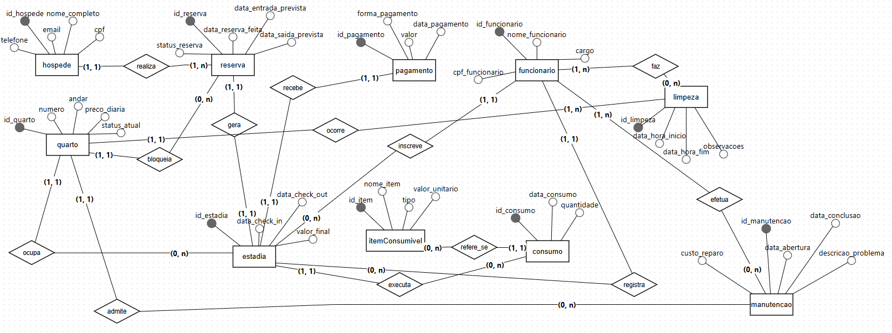

# Minimundo: Hotel "Bons Sonhos"

Este modelo foca na gestão direta dos quartos ("quarto único") e na execução operacional (Estadia, Consumo, Manutenção, Limpeza), permitindo um controle preciso das operações do hotel.

---

## Diagrama conceitual:

[Visualizar modelo](https://app.brmodeloweb.com/#!/publicview/692488ba1cfec044073506da)

## 1. Entidades Propostas

Abaixo estão as principais entidades necessárias para cobrir os requisitos do cenário, incluindo gestão de hospedagem, consumo, limpeza e financeiro.

### Hóspede
Representa o cliente responsável financeiro pela reserva.
* **Atributos:** `ID_Hospede` (PK), Nome Completo, CPF, Telefone, E-mail.

### Quarto
A unidade física real onde as pessoas dormem. Como não há tipos de quarto, cada unidade possui seu preço e capacidade definidos individualmente.
* **Atributos:** `ID_Quarto` (PK), Número, Andar, **Preco_Diaria**, **Capacidade_Pessoas**, Status_Atual (Ex: Livre, Ocupado, Em Limpeza, Em Manutenção).

### Reserva
A intenção de hospedagem futura. Vincula o hóspede a um **quarto específico** e às datas previstas.
* **Atributos:** `ID_Reserva` (PK), Data_Reserva_Feita, Data_Entrada_Prevista, Data_Saida_Prevista, Status_Reserva (Ex: Ativa, Cancelada, Concluída).

### Estadia
O período real em que o hóspede ocupa o quarto. É gerada no momento do *Check-in* a partir de uma reserva.
* **Atributos:** `ID_Estadia` (PK), Data_CheckIn, Data_CheckOut, Valor_Final.

### Pagamento
Registra as transações financeiras para quitar o valor da estadia e consumos.
* **Atributos:** `ID_Pagamento` (PK), Valor, Data_Pagamento, Forma_Pagamento (Ex: Cartão, PIX, Dinheiro).

### ItemConsumivel
Produtos do frigobar ou serviços de quarto que podem ser solicitados.
* **Atributos:** `ID_Item` (PK), Nome_Item, Tipo (Produto/Serviço), Preço_Unitário.

### Consumo
Entidade associativa que registra o fato de um hóspede (em uma estadia) ter consumido um item.
* **Atributos:** `ID_Consumo` (PK), Data_consumo, Quantidade.

### funcionário
A equipe do hotel. Neste modelo, centraliza as ações de limpeza, manutenção e atendimento (recepção).
* **Atributos:** `ID_Funcionario` (PK), Nome_funcionario, CPF_Funcionario, Cargo.

### Limpeza
Registra a execução da limpeza de um quarto por um funcionário.
* **Atributos:** `ID_Limpeza` (PK), Data_Hora_Inicio, Data_Hora_Fim, Observacoes.

### Manutenção
Registra reparos necessários em um quarto (bloqueando-o para uso).
* **Atributos:** `ID_Manutencao` (PK), Data_Abertura, Data_Conclusao, Descricao_Problema, Custo_Reparo.

---

## 2. Relacionamentos e Cardinalidades

Abaixo, a descrição das interações usando a notação `(Min, Max)`. 
### Fluxo de Reserva e Hospedagem
* **Hóspede realiza Reserva**
    * Hóspede `(1,1)` — `(1,N)` Reserva.
* **Reserva bloqueia Quarto** 
    * Reserva `(0,N)` — `(1,1)` Quarto. *(A reserva prende um quarto específico)*.
* **Reserva gera Estadia**
    * Reserva `(1,1)` — `(1,1)` Estadia.
* **Estadia ocupa Quarto**
    * Estadia `(0,N)` — `(1,1)` Quarto.
* **Funcionário inscreve Estadia** 
    * Funcionário `(1,1)` — `(0,N)` Estadia.

### Fluxo Financeiro e Consumo
* **Estadia executa Consumo**
    * Estadia `(1,1)` — `(0,N)` Consumo.
* **Consumo refere-se a ItemConsumivel**
    * Consumo `(1,1)` — `(0,N)` ItemConsumivel.
* **Estadia recebe Pagamento**
    * Estadia `(1,1)` — `(1,1)` Pagamento.

### Fluxo Operacional (Serviços e Manutenção)
* **Funcionário faz Limpeza**
    * Funcionário `(1,N)` — `(0,N)` Limpeza.
* **Limpeza ocorre em Quarto**
    * Limpeza `(1,N)` — `(1,1)` Quarto.
* **Quarto sofre Manutenção**
    * Quarto `(1,1)` — `(0,N)` Manutenção.
* **Funcionário efetua Manutenção** 
    * Funcionário `(1,N)` — `(0,N)` Manutenção.